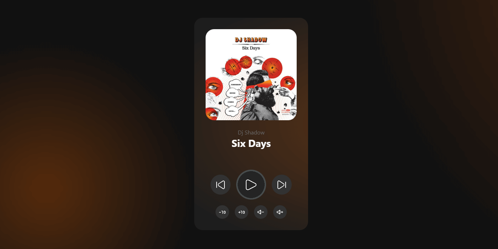

# Projeto Simples de Reprodutor de Música

Este projeto é um reprodutor de música simples criado utilizando HTML, CSS e JavaScript. Ele permite aos usuários tocar músicas predefinidas com controles como reproduzir, próxima música, música anterior, aumentar e diminuir o volume, e avançar ou retroceder 10 segundos.

## Objetivo

O principal objetivo deste projeto foi praticar e reforçar os conceitos de HTML, CSS e JavaScript aprendidos até agora. Aproveitando meu conhecimento existente de JavaScript, eu quis criar um projeto mais interativo. O projeto utiliza a tag de áudio do HTML em conjunto com JavaScript para manipular a música de várias maneiras.

## Demonstração Ao Vivo

Você pode visualizar a demonstração ao vivo do projeto [aqui](https://lugom.io/projects/simple-music-player/index.html).

## Arquivo de Design no Figma

O design deste projeto foi criado utilizando o Figma. Você pode visualizar o arquivo de design [aqui](https://www.figma.com/file/jJGq8lPlujRnRv1jt73x7Z/simple-music-player?type=design&mode=design&t=0z5yPO0VBXWWJ86f-1).

Sinta-se à vontade para explorar o projeto e fornecer qualquer feedback ou sugestões!